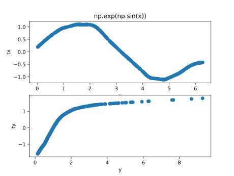

# Alternating Conditional Expectation Algorithm
[](https://travis-ci.org/zhaofeng-shu33/ace_cream)

This project provides a wrapper program of Python for ACE algorithm implementation of Fortran.

## How to build
You need `numpy` and fortran compiler to build from source.

### Windows

* Install [Visual C++](https://blogs.msdn.microsoft.com/vcblog/2017/03/07/msvc-the-best-choice-for-windows/) toolchain.

* Download MinGW-w64 from [sourceforge](https://sourceforge.net/projects/mingw-w64/files/latest/download?source=typ_redirect), which provides the necessary fortran compiler

* Install MinGW-w64 and add `{install_dir}\mingw64\bin` path to environment variable (make `gfortran` accessible from command line).

  * (for conda environment) Add `{install_dir}\Anaconda3\Scripts` to environment variable (make `f2py` accessible from command line).

    

### Mac

You can use package manager to install `gfortran` (included within gnu compiler collection). For example, with `Homebrew` you can use

```shell
brew install gcc
```

### Ubuntu

To install `gfortran`, use the default package manager:

```shell
sudo apt-get install gfortran
```

Run `python setup.py install` from command line at the project root directory.

## Install Binary Distribution
Currently, only 64-bit binary distribution is provided.

| Platform | py3.5 | py3.6 | py2.7 |
| -------- | :---: | :---: | :---: |
| Windows  |   T   |   T   |   T   |
| MacOS    |       |   T   |   T   |
| Linux    |       |       |       |

## How to use

```Python
import numpy as np
from ace_cream import ace_cream
# discrete case, binary symmetric channel with crossover probability 0.1
x = np.random.choice([0,1], size=N_SIZE)
n = np.random.choice([0,1], size=N_SIZE, p=[0.9, 0.1])
y = np.mod(x + n, 2)
# set both x(cat=0) and y(cat = -1) as categorical type
tx, ty = ace_cream(x, y, cat=[-1,0])

# continuous case
x = np.random.uniform(0, np.pi, 200)
y = np.exp(np.sin(x)+np.random.normal(size=200)/2)
tx, ty = ace_cream(x, y)
```
## Result


## change log
1. v0.1 initial commit
1. v0.2 modify to relative import in `__init__.py`
1. v0.3 add support for multiple columns of x and other directions of transformation
1. v0.4 add `f_mapping` function and unittests for this function

## License
Apache License Version 2.0
